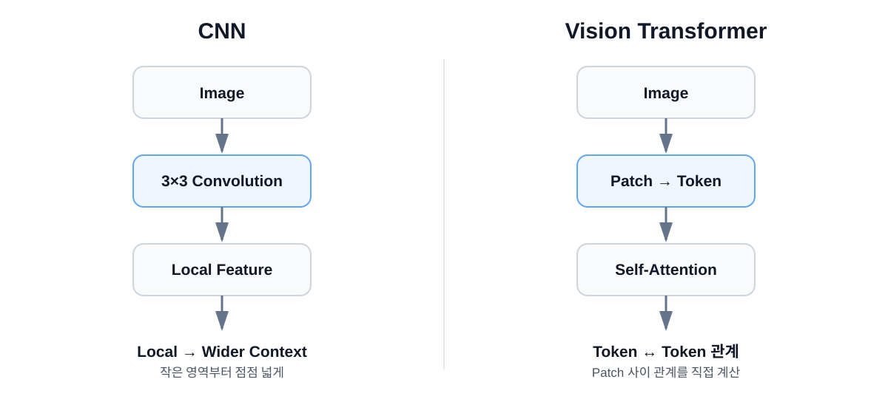

# Vision AI Study & Lecture

Vision AI를 처음 접하는 사람도 **현실 세계 → Sensor → 숫자 데이터 → AI 학습 → CNN → Vision Transformer** 순서로 이해할 수 있도록 만든 학습/강의 저장소입니다.

이 저장소는 세 가지를 함께 목표로 합니다.

1. **학습 노트** — 개념을 쉬운 말과 수치 예제로 정리
2. **강의 자료** — 글보다 흐름, 그림, 비교 중심으로 설명
3. **실습 자료** — Notebook과 웹 데모로 개념을 직접 확인

## 학습 순서

```text
01. Vision AI 입문
        ↓
02. AI 기초
   - Weight / Parameter
   - 비선형성 / Activation
   - Loss / Backpropagation
   - Dataset / Train-Val-Test
        ↓
03. CNN
        ↓
04. Vision Transformer
        ↓
Classification / Detection / Segmentation / Tracking / 3D
        ↓
실제 Vision AI 개발과 운영
```

| 순서 | 챕터 | 핵심 질문 |
|---|---|---|
| 1 | [Vision AI 입문](lectures/01_intro/README.md) | 컴퓨터는 현실 세계를 어떤 데이터로 보는가? |
| 2 | [AI 기초](lectures/02_ai_basics/README.md) | 신경망은 왜 비선형성이 필요하고 어떻게 학습하는가? |
| 3 | [CNN](lectures/03_cnn/README.md) | 작은 필터로 어떻게 이미지 Feature를 학습하는가? |
| 4 | [Vision Transformer](lectures/04_vision_transformer/README.md) | 이미지를 왜 Patch와 Token으로 바꾸고 관계를 보는가? |

## 설명 방식

별도 용어집을 외우게 하지 않습니다.

각 챕터에서 처음 등장하는 용어를 그 자리에서 설명합니다.

예:

```text
CNN
 ├─ Kernel이란?
 ├─ Convolution이란?
 ├─ Feature Map이란?
 └─ Receptive Field란?

ViT
 ├─ Patch란?
 ├─ Token이란?
 ├─ Embedding이란?
 └─ Self-Attention이란?
```

## CNN과 ViT 한눈에 보기



- **CNN**: 작은 영역의 패턴을 반복적으로 추출하면서 점점 넓고 추상적인 Feature를 만듭니다.
- **Vision Transformer**: 이미지를 Patch Token으로 바꾸고 각 Token 사이의 관계를 Self-Attention으로 학습합니다.

둘 중 하나가 항상 우월한 것은 아닙니다. 데이터 규모, 해상도, 연산량, 문제 특성에 따라 선택이 달라집니다.

## 저장소 구조

```text
vision_ai/
├── README.md
├── lectures/
│   ├── 01_intro/
│   ├── 02_ai_basics/
│   ├── 03_cnn/
│   └── 04_vision_transformer/
├── assets/
│   ├── diagrams/
│   └── SOURCES.md
├── notebooks/
├── demos/
└── docs/
```

## 작성 원칙

- 수식보다 먼저 **입력 → 처리 → 출력** 흐름을 설명합니다.
- 핵심 개념에는 가능한 한 **수치 예시**를 붙입니다.
- 용어는 별도 목록보다 **실제 맥락 안에서 바로 설명**합니다.
- 시각 자료는 직접 제작한 Diagram과 출처가 명확한 이미지를 우선 사용합니다.
- 교육적 비유와 엄밀한 정의를 구분합니다.
- 모델 구조뿐 아니라 **Dataset, 평가, 운영 환경**까지 함께 설명합니다.

## Web Lecture

정적 강의 사이트는 [docs/index.html](docs/index.html)에 있습니다.

디자인은 **흰색 배경, 짙은 본문, 최소한의 포인트 컬러**를 기본으로 합니다.
