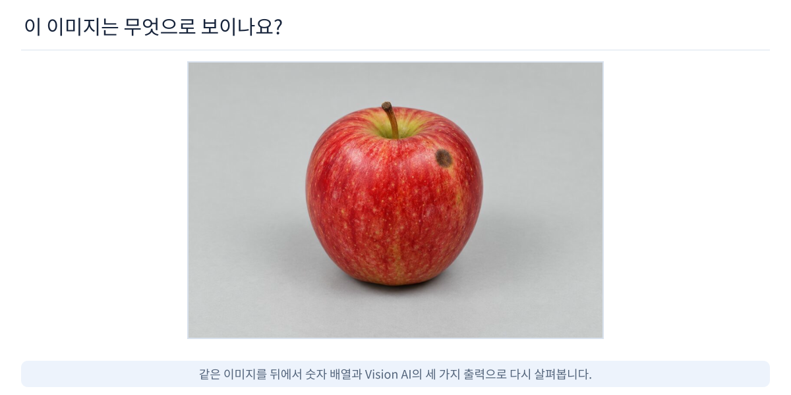
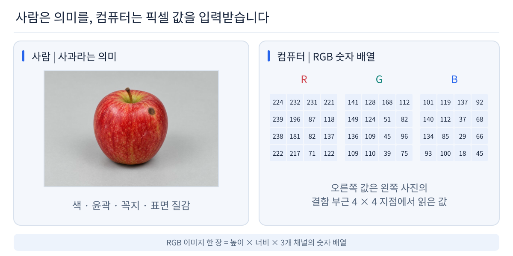
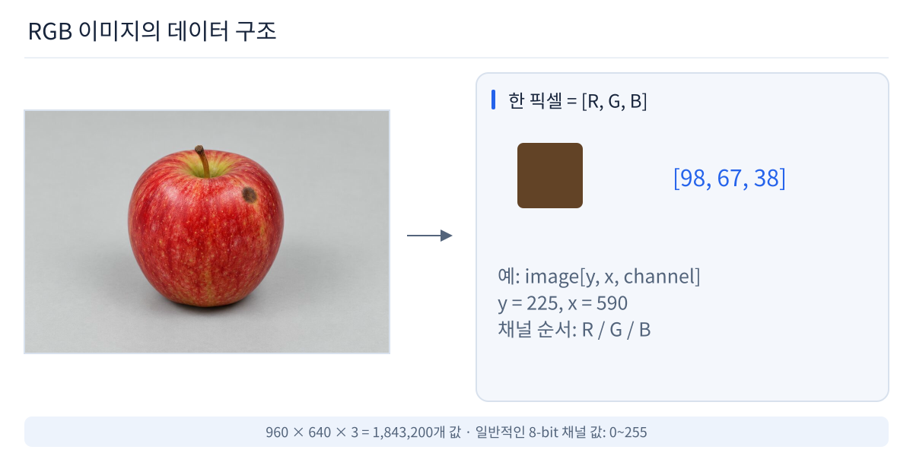

# 01. Vision AI 입문

## 첫 질문

강의는 정의부터 시작하지 않습니다.



> 이 이미지는 무엇으로 보이나요?

사람은 곧바로 “사과”라고 답할 수 있습니다. 하지만 컴퓨터가 처음 받는 것은 의미가 아니라 Pixel과 Channel의 숫자입니다.



## 사람은 의미를 보고, 컴퓨터는 숫자를 받는다

```text
사람
이미지 → 색 / 윤곽 / 질감 / 부분 구조 → “사과”

컴퓨터
이미지 → Pixel / Channel 값 → 숫자 배열
```

Vision AI의 핵심 질문은 다음입니다.

> 수많은 숫자에서 어떻게 물체, 위치, 형태, 상태 같은 의미를 찾을까?

## 이미지는 숫자 배열이다



예:

```text
224 × 224 RGB
= 224 × 224 × 3
= 150,528 channel values
```

Full HD:

```text
1920 × 1080 × 3
= 6,220,800 values / frame
```

30 FPS라면 1초에 186,624,000개의 Channel 값이 들어옵니다.

### Pixel
디지털 이미지의 한 위치입니다.

### Channel
한 Pixel이 가지는 정보 축입니다. RGB는 R/G/B 3개 Channel을 가집니다.

### Tensor
딥러닝에서 이미지와 Feature를 표현하는 다차원 숫자 배열입니다.

## 왜 Vision은 어려운가?

같은 사과도 촬영 조건이 달라지면 Pixel 값은 크게 바뀝니다.

- 조명
- 그림자
- 카메라 각도
- 거리 / 크기
- 회전
- 가림
- Motion Blur
- 배경
- Sensor / Lens 차이

사람은 같은 물체라고 이해하지만 컴퓨터가 받는 숫자는 달라집니다.

## 그래서 Vision AI가 필요하다

```text
Real World
    ↓
Sensor
    ↓
Numeric Data
    ↓
Vision AI
    ↓
Meaning
    ↓
판단 / 측정 / 제어
```

Vision AI는 이미지뿐 아니라 여러 시각 센서의 데이터를 사용할 수 있습니다.

## Vision Sensor

| 센서 | 주로 얻는 정보 | 대표 데이터 |
|---|---|---|
| RGB Camera | 색과 밝기 | H×W×3 Image |
| Mono Camera | 밝기 | H×W Image |
| IR / NIR | 적외선 반사 | Intensity Image |
| Thermal | 열 분포 | Temperature Map |
| Depth Camera | 거리 | Depth Map |
| LiDAR | 3차원 거리 | Point Cloud |
| Event Camera | 밝기 변화 Event | Event Stream |

## 다음 질문

이제 다음 질문으로 넘어갑니다.

> 컴퓨터는 이 숫자에서 어떻게 규칙을 배울까?

→ [02. AI 기초](../02_ai_basics/README.md)
