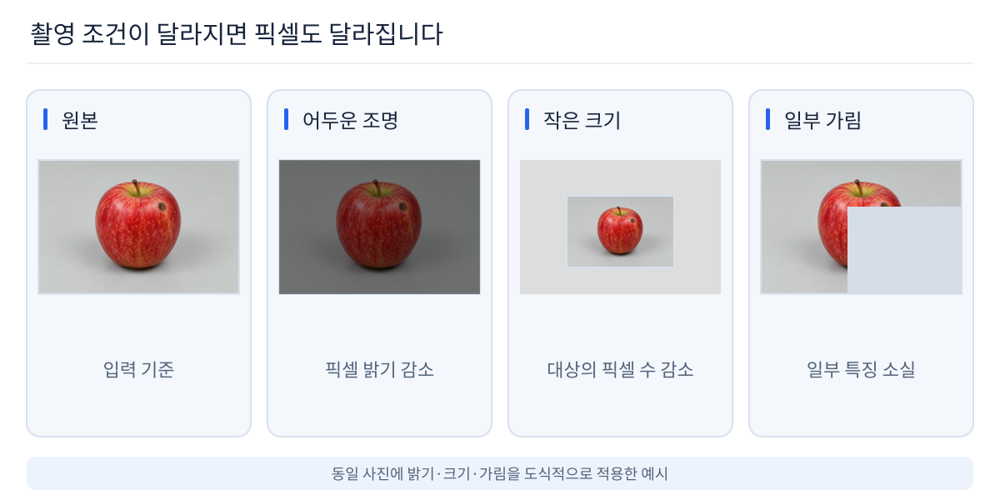
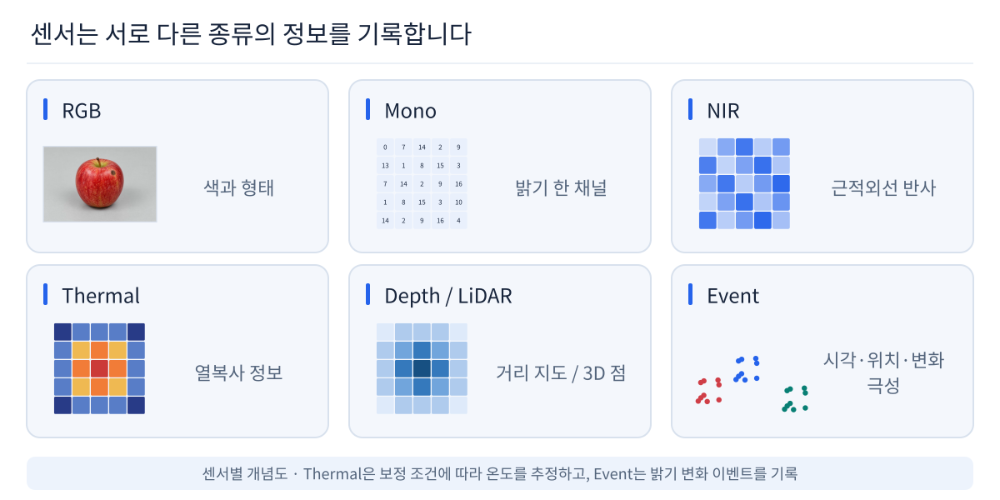

# 01. Vision AI 입문

## 1. 첫 질문


> 이 이미지는 무엇으로 보이나요?

대부분의 사람은 곧바로 “사과”라고 답합니다.

하지만 컴퓨터가 처음 받는 것은 “사과”라는 의미가 아니라 **Pixel과 Channel의 숫자**입니다.


## 2. 사람은 의미를 보고, 컴퓨터는 숫자를 받는다

```text
사람
이미지
 ↓
색 / 윤곽 / 질감 / 부분 구조
 ↓
“사과”

컴퓨터
이미지
 ↓
Pixel / Channel 값
 ↓
숫자 배열
```

**Vision AI의 핵심 질문**

> 이 숫자에서 어떻게 물체와 상태의 의미를 찾을까?

## 3. 이미지는 Pixel과 Channel로 이루어진 숫자 배열이다


예:

```text
224 × 224 RGB
= 224 × 224 × 3
= 150,528 channel values
```

### Pixel
이미지의 한 위치입니다.

### Channel
한 Pixel이 가지는 정보 축입니다.

RGB:

```text
R
G
B
→ 3 Channels
```

### Tensor
딥러닝에서 이미지와 Feature를 표현하는 다차원 숫자 배열입니다.

## 4. 그런데 같은 사과도 전혀 다르게 보일 수 있다



같은 사과라도 다음 조건에 따라 입력 데이터는 크게 바뀝니다.

- **조명**: 밝기, 그림자, 반사
- **시점**: 카메라 각도와 회전
- **크기**: 거리와 해상도
- **가림**: 일부 특징이 보이지 않음
- **배경**: 물체와 배경의 대비와 경계가 달라짐
- **흐림**: Motion Blur, 초점 변화
- **색온도**: Warm / Cool 조명
- **노이즈**: 저조도, Sensor Noise

사람은 여전히 같은 사과라고 이해하지만 컴퓨터가 받는 Pixel은 서로 다릅니다.

## 5. AI가 배워야 하는 것은 변하는 Pixel이 아니라 유지되는 의미

```text
밝은 사과
어두운 사과
기울어진 사과
작게 보이는 사과
가려진 사과
흐릿한 사과
      ↓
서로 다른 Pixel
      ↓
중요한 Feature 학습
      ↓
공통된 의미
      ↓
“사과”
```

**Generalization**은 입력 조건이 달라져도 중요한 특징을 유지해 올바르게 판단하는 능력입니다.

학습에서 본 이미지와 완전히 같은 이미지만 맞히는 것이 아니라,
새로운 조명·각도·배경에서도 중요한 특징을 찾아야 합니다.

## 6. 그래서 Vision AI가 필요하다

```text
Real World
    ↓
Sensor
    ↓
Numeric Data
    ↓
Vision AI
    ↓
Meaning
    ↓
판단 / 측정 / 제어
```

Vision AI는 시각 Sensor Data에서 의미 있는 정보를 추출해 실제 판단과 측정으로 연결합니다.

## 7. 어디에 쓰일까?

대표 예:

- Smartphone Camera
- OCR / QR
- 차량 / 로봇
- 제조 품질 검사
- 의료 영상
- 영상 Monitoring
- Visual Search
- 3D / 공간 인식

## 8. 컴퓨터의 눈은 RGB Camera 하나가 아니다

Vision AI에서 입력은 일반적인 RGB 사진만이 아닙니다.

| Sensor | 얻는 정보 | 대표 데이터 |
|---|---|---|
| RGB Camera | 색과 밝기 | H×W×3 Image |
| Mono Camera | 밝기 | H×W Image |
| IR / NIR | 적외선 반사 | Intensity Image |
| Thermal | 열 분포 | Temperature Map |
| Depth Camera | 거리 | Depth Map |
| LiDAR | 3차원 거리 | Point Cloud |
| Event Camera | 밝기 변화 | Event Stream |



센서 선택에서 중요한 질문:

> 어떤 모델을 쓸까?

보다

> **어떤 정보를 Sensor로 얻을 수 있을까?**

에 가깝습니다.

## 9. AI는 숫자에서 규칙과 Feature를 학습한다

```text
Sensor / Image
      ↓
Numeric Data
      ↓
AI Learning
      ↓
Feature / Representation
      ↓
Meaning / Prediction
```

> AI는 이 숫자에서 어떻게 규칙과 Feature를 배울까?

→ [02. AI 기초](../02_ai_basics/README.md)
