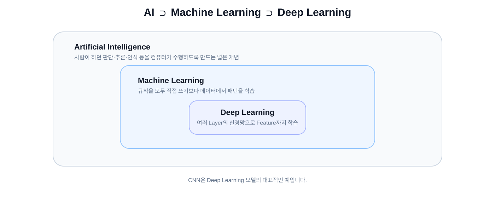
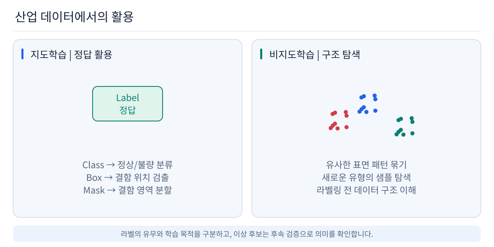
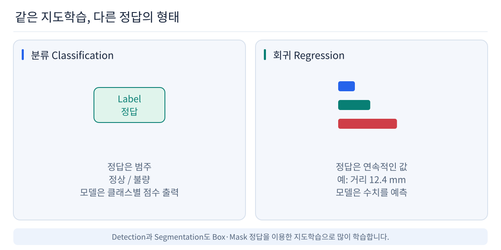
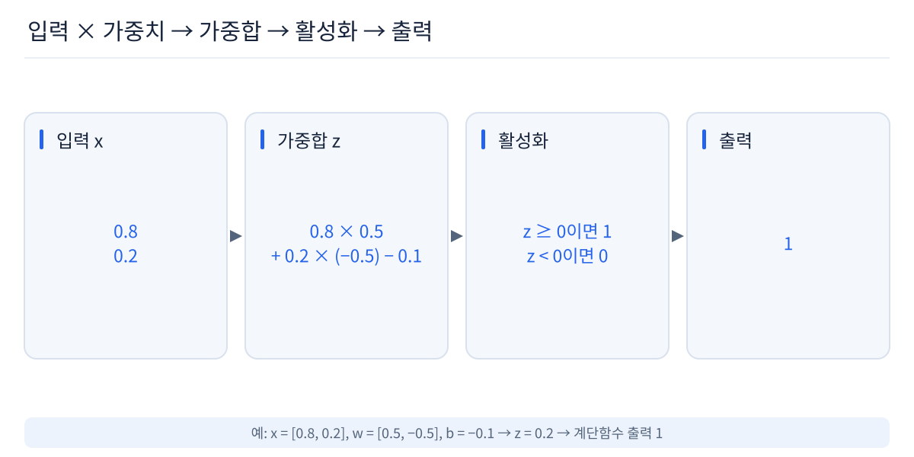
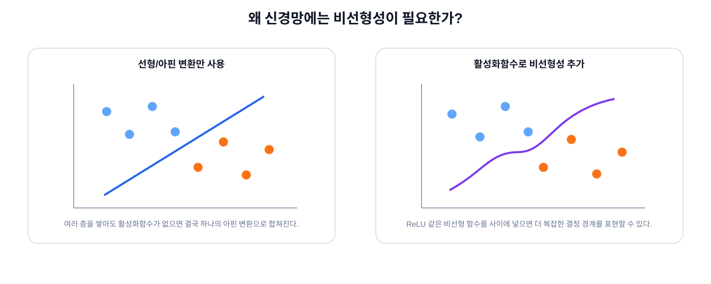
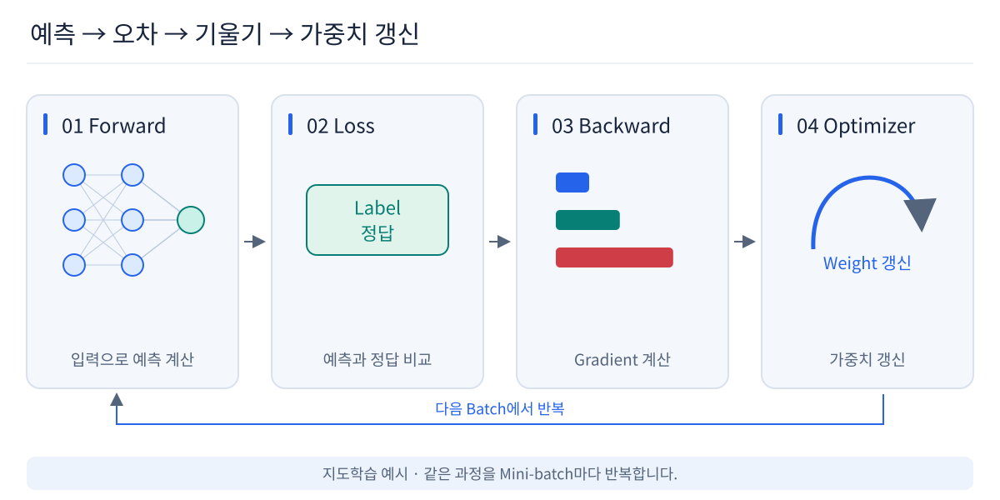
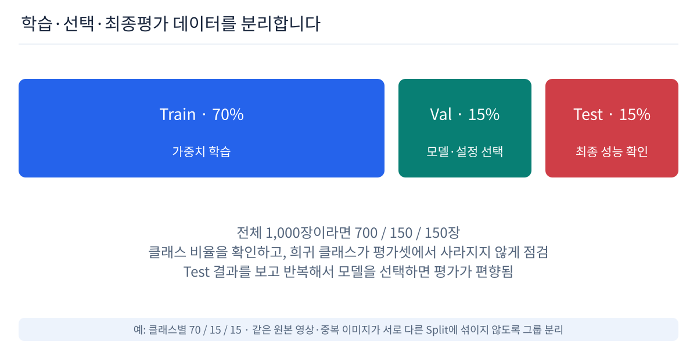
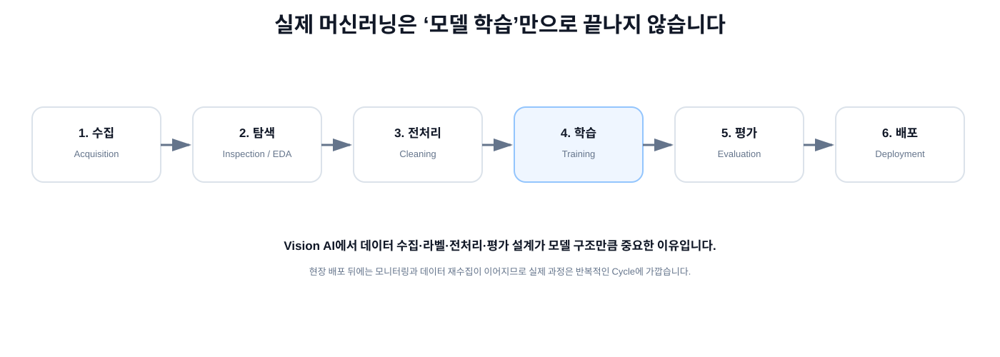

# 02. AI 기초 — 데이터에서 규칙을 배우는 방법

Vision AI 모델을 보기 전에 AI, 머신러닝, 딥러닝의 관계와 신경망이 어떻게 학습하는지 이해합니다.

## 1. AI / Machine Learning / Deep Learning

```text
Artificial Intelligence
└─ Machine Learning
   └─ Deep Learning
      └─ CNN
```

- **AI**: 사람이 하던 판단·추론·인식 등을 컴퓨터가 수행하도록 만드는 넓은 개념
- **Machine Learning**: 규칙을 모두 직접 작성하기보다 데이터에서 패턴을 학습
- **Deep Learning**: 여러 Layer의 신경망을 사용해 Feature까지 학습



## 2. Rule-based와 Machine Learning

Rule-based:

```text
사람이 규칙 작성
if 밝기 > 100 and 면적 > 50:
    abnormal
```

Machine Learning:

```text
Data + Label
    ↓
Training
    ↓
Weight 학습
    ↓
Prediction
```

조건이 단순하고 명확하면 Rule-based 방식도 매우 강력합니다. 하지만 이미지처럼 조건이 복잡해지면 사람이 모든 규칙을 직접 작성하기 어려워집니다.

## 3. 학습 방식

### 지도학습 Supervised Learning
입력 X와 정답 y를 함께 보며 관계를 학습합니다. 이번 강의의 중심입니다.

### 비지도학습 Unsupervised Learning
정답 Label 없이 데이터의 구조나 군집, 표현을 찾습니다.

### 강화학습 Reinforcement Learning
행동에 따른 보상을 이용해 더 좋은 행동 전략을 학습합니다.

### 산업에서는 어떻게 사용할까?



지도학습 예:
- 정상 / 불량 분류
- 결함 Bounding Box Detection
- Pixel Mask Segmentation
- OCR / 품종 판정

비지도학습 예:
- 유사 패턴 군집화
- 라벨 기준을 만들기 전 데이터 탐색
- 미라벨 데이터의 Representation 학습
- 정상 분포와 다른 이상 후보 탐색

단, **Anomaly Detection이 항상 비지도학습인 것은 아닙니다.** 지도학습, One-class, Self-supervised 등 여러 접근이 사용됩니다.

## 4. 분류와 회귀



### Classification
정해진 범주 중 하나를 예측합니다.

```text
Normal / Abnormal
Cat / Dog
Scratch / Particle / Normal
```

### Regression
연속적인 값을 예측합니다.

```text
거리 = 12.4 mm
온도 = 37.1 °C
offset = 2.8 px
```

### Binary / Multi-class Classification

- Binary: 두 Class 중 하나
- Multi-class: 세 개 이상의 Class 중 하나

분류 모델에서는 raw score를 Sigmoid 또는 Softmax 등을 통해 해석 가능한 값으로 바꾸는 경우가 많습니다.

## 5. Model, Parameter, Hyperparameter

```text
Input x
  ↓
Model f(x; θ)
  ↓
Prediction y_hat
```

- **Parameter**: 모델이 학습하면서 바꾸는 값. Weight, Bias 등
- **Hyperparameter**: 사람이 정하거나 탐색하는 값. Learning Rate, Batch Size, Layer 수 등

## 6. Perceptron

Perceptron은 여러 입력에 Weight를 곱하고 합한 뒤 출력으로 보내는 초기 형태의 인공 신경망입니다.



```text
x1 × w1
x2 × w2
x3 × w3
   ↓
모두 더함 + bias
   ↓
Activation
   ↓
Prediction
```

Weight가 크다는 것은 해당 입력을 더 강하게 반영한다는 뜻으로 이해할 수 있습니다.

## 7. 왜 Layer와 비선형성이 필요한가?

단순한 하나의 선형 결정 경계로는 XOR 같은 문제를 해결할 수 없습니다.

```text
0,0 → 0
0,1 → 1
1,0 → 1
1,1 → 0
```

Hidden Layer를 사용하면 중간 Feature를 만들 수 있지만, Linear/Affine Layer만 연속해서 쌓으면 전체는 다시 하나의 Affine Transformation으로 합쳐집니다.



그래서 Layer 사이에 **Activation Function**을 넣어 비선형성을 부여합니다.

### ReLU

```text
ReLU(x) = max(0, x)

[-2, -0.5, 0, 1, 3]
        ↓
[ 0,  0,   0, 1, 3]
```

## 8. Feature와 Representation

- **Feature**: 문제를 푸는 데 유용한 특징
- **Representation**: 입력을 모델 내부에서 다시 표현한 숫자 형태

```text
Raw Input
   ↓
Simple Feature
   ↓
Combined Feature
   ↓
Task에 유용한 Representation
```

CNN에서는 이 개념이 Pixel → Edge/Texture → Shape → Object-level Feature 같은 직관으로 이어집니다.

## 9. 학습 Training

학습은 정답에 더 가까운 Prediction을 만들도록 Weight를 반복해서 수정하는 과정입니다.



```text
Input + Label
      ↓
Forward
      ↓
Prediction
      ↓
Loss
      ↓
Backpropagation
      ↓
Gradient
      ↓
Optimizer
      ↓
Weight Update
```

### Loss
Prediction과 정답의 차이를 숫자로 표현합니다.

### Gradient
Weight를 조금 바꿀 때 Loss가 어느 방향으로 얼마나 변하는지를 나타냅니다.

### Backpropagation
출력의 Loss에서 시작해 각 Parameter의 Gradient를 계산합니다.

### Optimizer
Gradient를 이용해 Weight를 업데이트합니다.

가장 단순한 직관:

```text
new_weight
=
old_weight - learning_rate × gradient
```

## 10. Learning Rate

한 번 Update할 때 Weight를 얼마나 크게 움직일지 결정합니다.

너무 크면 학습이 불안정해질 수 있고, 너무 작으면 학습이 지나치게 느릴 수 있습니다.

## 11. Batch / Iteration / Epoch

- **Batch**: 한 Step에서 함께 사용하는 샘플 묶음
- **Iteration / Step**: 한 Batch로 Weight를 한 번 업데이트
- **Epoch**: 전체 Train Dataset을 한 번 모두 사용

예:

```text
10,000 images
batch_size = 32

약 313 iterations
≈ 1 epoch
```

전체 Dataset을 한 번에 계산하기 어렵기 때문에 보통 Mini-batch 단위로 학습합니다.

## 12. Dataset은 모델이 배우는 세상

좋은 모델만으로는 충분하지 않습니다.

```text
좋은 Architecture
+
나쁜 Label
+
편향된 Dataset
=
신뢰하기 어려운 Model
```

Dataset에는 다음이 중요합니다.

- 실제 운영 조건을 대표하는가?
- Label 기준이 정확하고 일관적인가?
- 희귀 Class가 충분히 포함되는가?
- 특정 장비·배경·날짜에 치우치지 않았는가?
- Train/Test 사이 Leakage가 없는가?

## 13. Train / Validation / Test



### Train
Weight를 실제로 학습합니다.

### Validation
모델 선택, Hyperparameter 조정, Early Stopping, Overfitting 확인 등에 사용합니다.

### Test
가능한 한 마지막까지 독립적으로 유지하고 최종 일반화 성능을 평가합니다.

교육적으로는 다음처럼 생각할 수 있습니다.

```text
Train      = 문제집
Validation = 모의고사
Test       = 최종 시험
```

## 14. Underfitting / Overfitting / Generalization

### Underfitting
Train 데이터조차 충분히 설명하지 못합니다.

### Overfitting
Train에는 매우 잘 맞지만 새로운 데이터에서는 성능이 떨어집니다.

### Generalization
학습에서 보지 못한 새로운 데이터에서도 잘 동작하는 능력입니다.

과적합 완화에는 더 다양한 데이터, 적절한 Data Augmentation, 모델 복잡도 조절, Regularization, Early Stopping 등이 사용될 수 있습니다.

### Data Leakage

예를 들어 같은 영상에서 나온 거의 동일한 Frame을 Train과 Test에 나누면 평가가 실제보다 좋아 보일 수 있습니다.

```text
same video
├─ Train: frame_001
└─ Test : frame_002
```

Vision 문제에서는 실제 독립 단위가 무엇인지 생각하고 Split해야 합니다.

## 15. 머신러닝 Workflow



```text
1. Data Acquisition
        ↓
2. Inspection / EDA
        ↓
3. Preprocessing / Cleaning
        ↓
4. Modeling / Training
        ↓
5. Evaluation
        ↓
6. Deployment
```

실제 Vision AI 개발에서는 배포 후에도 모니터링, 실패 사례 수집, 재학습이 이어지므로 반복 Cycle에 가깝습니다.

## 16. Vision AI로 연결

```text
Image Tensor
    ↓
Convolution
    ↓
Activation
    ↓
Feature
    ↓
Convolution
    ↓
Higher-level Feature
    ↓
Prediction
```

Vision AI에서 자주 쓰는 CNN의 Kernel도 고정된 규칙이 아니라 Dataset에서 학습되는 Weight입니다.

→ [03. Vision AI](../03_vision_ai/README.md)

## 참고

기초 구성은 WikiDocs의 「딥 러닝 파이토치 교과서」 중 머신러닝 Workflow, 데이터 분리, 선형 회귀/경사하강법, Mini-batch, Perceptron, XOR, Overfitting 파트를 참고하여 Vision AI 입문 강의에 맞게 재구성했습니다.

- https://wikidocs.net/book/2788
