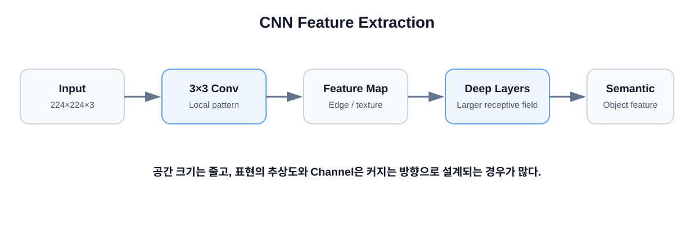

# 02. CNN — 이미지를 작은 영역부터 이해하기

## 학습 목표

- Convolution이 무엇인지 설명할 수 있다.
- Kernel, Feature Map, Stride, Padding을 구분할 수 있다.
- CNN이 깊어질수록 어떤 Feature를 학습하는지 설명할 수 있다.
- VGG와 ResNet의 핵심 아이디어를 이해한다.



## 1. CNN의 핵심 아이디어

CNN은 이미지를 처음부터 전체로 이해하려 하지 않습니다.

작은 영역부터 봅니다.

```text
Image
  ↓
3×3 Kernel
  ↓
Local Feature
  ↓
더 많은 Convolution
  ↓
점점 큰 Feature
  ↓
Semantic Feature
```

## 2. Kernel / Filter

`3×3` Kernel은 9개의 Weight를 가진 작은 창이라고 생각할 수 있습니다.

```text
 1   0  -1
 1   0  -1
 1   0  -1
```

이 예시는 사람이 설계한 수직 Edge Filter와 비슷하지만, 실제 CNN에서는 Filter Weight를 학습으로 찾습니다.

## 3. Convolution

입력의 작은 영역과 Kernel의 값을 위치별로 곱하고 모두 더합니다.

```text
Input Patch         Kernel

1 2 1               1  0 -1
0 1 0       ×       1  0 -1
1 2 1               1  0 -1
```

이 연산을 이미지 여러 위치에서 반복해 Feature Map을 만듭니다.

## 4. Feature Map

Kernel이 특정 패턴에 강하게 반응한 위치가 크게 나타나는 출력입니다.

초기 Layer에서는 Edge나 Texture에 가까운 패턴이 나타날 수 있고, 깊은 Layer에서는 더 복잡한 형태와 의미적 특징이 표현될 수 있습니다.

교육적으로 다음처럼 이해하면 쉽습니다.

```text
Pixel
 ↓
Edge
 ↓
Texture
 ↓
Shape
 ↓
Object Part
 ↓
Semantic Feature
```

이 단계가 항상 사람이 해석 가능한 단일 의미로 깔끔하게 분리되는 것은 아닙니다.

## 5. Channel

입력이 `224×224×3`이고 64개의 Filter를 사용한다고 가정하면 출력은 예를 들어 다음과 같을 수 있습니다.

```text
224 × 224 × 3
       ↓
   Conv 64
       ↓
224 × 224 × 64
```

출력 Channel 수는 Filter 수와 대응합니다.

## 6. Stride와 Padding

출력 크기는 다음 관계로 계산할 수 있습니다.

```text
O = floor((W - K + 2P) / S) + 1
```

예:
- 입력 `W=224`
- Kernel `K=3`
- Padding `P=1`
- Stride `S=1`

이면 출력은 `224`입니다.

## 7. Receptive Field

첫 번째 `3×3 Conv`는 원본의 작은 영역을 봅니다.  
그 위에 Conv를 계속 쌓으면 한 Feature가 간접적으로 참고하는 원본 영역이 점점 커집니다.

Stride 1의 단순한 `3×3 Conv`를 연속해서 쌓는 예:

```text
1 layer  → 약 3×3
2 layers → 약 5×5
3 layers → 약 7×7
```

이것이 CNN이 작은 영역에서 시작해 더 넓은 문맥을 이해하는 핵심입니다.

## 8. Pooling / Downsampling

공간 크기를 줄이는 이유:

- 연산량 감소
- 더 넓은 문맥 확보
- 세부 위치보다 의미적 특징에 집중

예:

```text
224×224×64
    ↓
112×112×128
    ↓
56×56×256
```

보통 H×W는 줄고 Channel은 늘어나는 방향으로 설계됩니다.

## 9. VGG가 보여준 것

VGG는 작은 `3×3 Conv`를 반복해 깊은 네트워크를 구성하는 설계를 널리 알렸습니다.

핵심 질문:

> 큰 Kernel 하나 대신 작은 Kernel을 여러 번 쌓으면 어떤 장점이 있을까?

- 더 많은 비선형 변환
- 점진적인 Feature 추출
- 구조가 단순하고 규칙적

원 논문: https://arxiv.org/abs/1409.1556

## 10. ResNet이 해결한 문제

단순히 Layer를 계속 깊게 쌓는다고 학습이 항상 쉬워지는 것은 아닙니다.

ResNet은 입력을 몇 Layer 뒤에 직접 더하는 Residual Connection을 사용합니다.

```text
x ───────────────────┐
│                    │
↓                    │
Conv → ReLU → Conv   │
│                    │
└────── F(x) + x ←───┘
```

수식:

```text
y = F(x) + x
```

원 논문: https://openaccess.thecvf.com/content_cvpr_2016/html/He_Deep_Residual_Learning_CVPR_2016_paper.html

## 11. CNN을 한 문장으로

> **CNN은 작은 지역 패턴을 반복적으로 추출하고 조합하면서 점점 넓고 추상적인 Feature를 만드는 모델입니다.**

## 12. 다음 챕터

CNN과 완전히 다른 관점으로 이미지를 보는 방법을 살펴봅니다.

→ [03. Vision Transformer](../03_vision_transformer/README.md)
