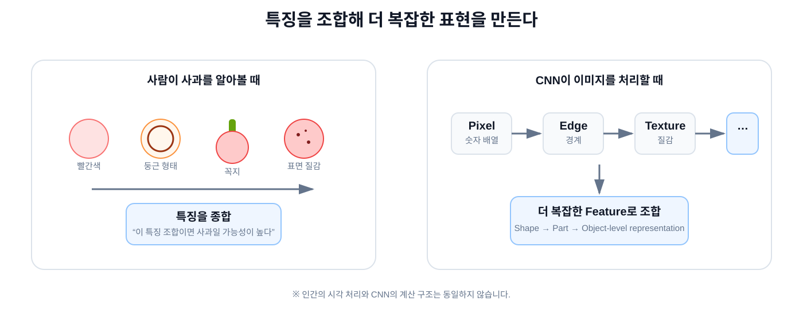

# 03. Vision AI — 문제에 맞는 Task와 CNN

## 1. 모델보다 먼저 Output을 정의한다

Vision AI에서 가장 먼저 결정할 것은 모델 이름이 아니라 **원하는 Output**입니다.

```text
현장 문제
   ↓
무엇을 알고 싶은가?
   ↓
원하는 Output
   ↓
Vision Task
   ↓
Label / Dataset
   ↓
Model
```

Classification, Detection, Segmentation은 **무엇을 출력할지**를 정의하는 Vision Task입니다.

## 2. Classification

질문: **이 이미지 전체는 무엇인가?**

```text
Output = Class / Probability

Apple 0.98
```

이미지 전체에 하나의 Category를 예측합니다. 객체의 정확한 위치는 직접 출력하지 않습니다.

## 3. Object Detection

질문: **무엇이 어디에 있는가?**

```text
Output
= Class
+ Bounding Box
+ Confidence
```

한 이미지 안의 여러 객체를 각각 찾고 위치를 Box로 표현합니다.

## 4. Segmentation

질문: **정확히 어느 Pixel인가?**

```text
Output = Pixel Mask
```

관심 대상의 형상과 영역을 Pixel 단위로 구분합니다.

## 5. Task가 달라지면 Label도 달라진다

같은 이미지라도 학습에 사용하는 정답 구조가 달라집니다.

```text
Classification
label = "apple"

Detection
label = class + (x, y, w, h)

Segmentation
label = H × W pixel mask
```

모델은 각 Task에서 Prediction과 Label의 차이를 줄이는 방향으로 학습합니다.

## 6. CNN은 어디에 들어갈까?

Convolutional Neural Network(CNN)는 이미지를 처리해 **Feature**를 만드는 데 널리 사용되는 Neural Network 구조입니다.

```text
Pixel
 ↓
Local Pattern
 ↓
Feature Combination
 ↓
Higher-level Feature
 ↓
Prediction
```

작은 영역에서 찾은 반응을 Layer를 거치며 조합합니다.



인간의 시각 처리와 CNN의 계산 구조가 동일하다는 의미는 아닙니다.

## 7. Kernel과 Convolution

Kernel(Filter)은 작은 Weight 배열입니다.

예를 들어 3 × 3 Kernel은 이미지의 3 × 3 Local 영역과 계산됩니다.

```text
Image Patch × Kernel
        ↓
곱하고 더함
        ↓
Feature Value
```

같은 Kernel Weight를 여러 위치에 반복 적용하는 것을 **Weight Sharing** 관점에서 볼 수 있습니다.

## 8. Feature Map과 Channel

한 Kernel을 이미지 여러 위치에 적용한 반응 결과를 **Feature Map**이라고 볼 수 있습니다.

```text
Input: 224 × 224 × 3
         ↓
      64 Kernels
         ↓
Output: 224 × 224 × 64
```

여기서 64개의 Feature Map이 Channel 축으로 쌓입니다.

## 9. Feature Hierarchy

초기 Layer에서 얻은 단순한 반응이 뒤쪽 Layer에서 조합되며 더 복잡한 Feature를 표현할 수 있습니다.

```text
Pixel
 ↓
Edge / Direction
 ↓
Texture / Local Pattern
 ↓
Shape / Part
 ↓
Higher-level Feature
```

실제 Feature가 항상 사람이 이름 붙일 수 있는 형태로 깔끔하게 분리되는 것은 아닙니다.

## 10. Receptive Field

Receptive Field는 한 Feature가 원본 입력의 어느 범위에 영향을 받는지를 나타냅니다.

Layer가 쌓이거나 Downsampling이 진행되면 더 넓은 문맥을 사용할 수 있습니다.

## 11. CNN도 Weight를 학습한다

```text
Image + Label
      ↓
CNN Forward
      ↓
Prediction
      ↓
Loss
      ↓
Backpropagation
      ↓
Kernel Weight Update
```

사람이 모든 Kernel을 직접 설계하는 것이 아니라, Loss가 줄어드는 방향으로 Weight가 학습됩니다.

## 12. Backbone과 Head

많은 Vision Model은 입문적으로 다음처럼 나눠 이해할 수 있습니다.

- **Backbone**: 이미지에서 공통 Feature를 추출하는 부분
- **Head**: Task에 맞는 Output을 만드는 부분

```text
Image
  ↓
Backbone
  ├─ Classification Head → Class Probability
  ├─ Detection Head      → Class + Box
  └─ Segmentation Head   → Pixel Mask
```

실제 Architecture는 모델마다 다르지만, **공통 Feature 추출 → Task별 Output** 관점은 구조를 이해하는 데 유용합니다.

## 13. 전체 흐름

```text
현장 문제
   ↓
원하는 Output
   ↓
Vision Task
   ↓
Dataset + Label
   ↓
Model Architecture
   ↓
Training
   ↓
Evaluation
   ↓
Deployment
```
