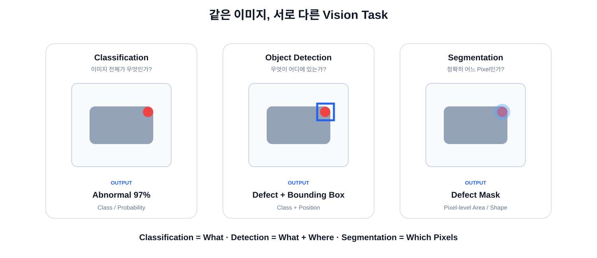

# 03. Vision AI — 문제에 맞는 Task와 CNN 이해하기

## 1. 모델보다 먼저 문제를 정의한다

Vision AI에서 가장 먼저 결정할 것은 모델 이름이 아니라 **원하는 Output**입니다.

```text
현장 문제
   ↓
무엇을 알고 싶은가?
   ↓
Vision Task
   ↓
Label / Dataset
   ↓
Model
```

Classification, Detection, Segmentation은 엄밀히는 Vision **Task**입니다. 실제 현장에서는 편의상 “분류 모델”, “검출 모델”, “세그 모델”이라고도 부릅니다.



## 2. Classification

질문:

> 이 이미지 전체는 무엇인가?

Output:

```text
Normal   0.03
Abnormal 0.97
```

산업 예:
- 제품 정상 / 불량
- 불량 종류
- 부품 종류
- 공정 상태

위치는 직접 알려주지 않습니다.

## 3. Object Detection

질문:

> 무엇이 어디에 있는가?

Output:

```text
Class
+ Bounding Box
+ Confidence
```

산업 예:
- 결함 위치
- 부품 누락
- 여러 객체 동시 검출
- ROI 자동 지정

## 4. Segmentation

질문:

> 정확히 어느 Pixel인가?

Output:

```text
Pixel Mask
```

산업 예:
- 결함 면적 측정
- 실제 형상 추출
- 윤곽 기반 치수
- 복잡한 ROI 생성

```text
Detection   = Box
Segmentation = Pixel-level Shape
```

## 5. Tracking

영상에서 시간에 따라 같은 객체를 계속 따라갑니다.

```text
Frame 1 → ID 3
Frame 2 → ID 3
Frame 3 → ID 3
        ↓
Trajectory / Speed / Event
```

## 6. Depth / 3D

거리와 공간 구조가 필요한 문제입니다.

- Depth Map
- Stereo
- LiDAR
- Point Cloud

산업 예:
- 두 물체 사이 거리
- 충돌 판단
- 높이 / 부피
- 로봇 공간 인식

## 7. 산업 문제를 Task로 바꾸기

| 현장 질문 | 주요 Task | 대표 Output |
|---|---|---|
| 제품이 정상인가? | Classification | Class / Probability |
| 불량이 어디에 있는가? | Detection | Bounding Box |
| 불량 면적은? | Segmentation | Pixel Mask |
| 물체가 어떻게 움직이는가? | Tracking | ID / Trajectory |
| 두 물체 사이 거리는? | Depth / 3D | Distance / Point Cloud |

## 8. CNN은 어디에 들어갈까?

Classification / Detection / Segmentation은 **무엇을 예측할지**에 대한 Task입니다.

CNN은 이미지를 처리해 Feature를 만드는 데 널리 사용된 대표적인 Neural Network 구조입니다.

교육적으로 다음 직관으로 이해할 수 있습니다.

```text
사람
색 + 윤곽 + 질감 + 부분 구조
        ↓
여러 특징을 조합
        ↓
사물 판단

CNN
Pixel
 ↓
Local Pattern
 ↓
Feature Combination
 ↓
Higher-level Feature
 ↓
Prediction
```


인간의 실제 시각 처리와 CNN이 동일하다는 의미는 아니며, Feature Hierarchy를 이해하기 위한 비유입니다.

## 9. CNN Feature Hierarchy

```text
Pixel
 ↓
Edge / 방향
 ↓
Texture / 반복 패턴
 ↓
Shape
 ↓
Object Part
 ↓
Object-level Feature
```

실제 Feature는 사람이 이름 붙일 수 있는 형태로 깔끔하게 분리되지 않을 수 있습니다.

## 10. Kernel / Filter

작은 이미지 영역에서 패턴을 찾기 위한 학습 가능한 Weight입니다.

```text
3 × 3 Kernel

[ w1 w2 w3 ]
[ w4 w5 w6 ]
[ w7 w8 w9 ]
```

## 11. Convolution

같은 Kernel을 이미지 여러 위치에 적용해 패턴 반응을 계산합니다.

```text
Image Patch × Kernel
        ↓
곱하고 더함
        ↓
Feature Value
```

### Weight Sharing
같은 Kernel Weight를 여러 위치에서 공유합니다.

## 12. Feature Map / Channel

**Feature Map**은 특정 Kernel이 각 위치에서 얼마나 반응했는지를 나타냅니다.

```text
224 × 224 × 3
       ↓
64 Filters
       ↓
224 × 224 × 64
```

여기서 64개의 Feature Map이 Channel 축에 쌓입니다.

## 13. Receptive Field / Downsampling

### Receptive Field
한 Feature가 원본 이미지에서 영향을 받는 영역입니다.

```text
3×3 Conv 1 layer → 약 3×3
3×3 Conv 2 layers → 약 5×5
3×3 Conv 3 layers → 약 7×7
```

### Downsampling

```text
224×224×64
    ↓
112×112×128
    ↓
56×56×256
```

공간 크기를 줄여 연산량을 줄이고 더 넓은 문맥을 효율적으로 표현합니다.

## 14. CNN도 학습으로 볼 특징을 정한다

```text
Image + Label
      ↓
CNN Forward
      ↓
Prediction
      ↓
Loss
      ↓
Backpropagation
      ↓
Kernel Weight Update
```

사람이 모든 Filter를 직접 지정하는 것이 아니라 Loss가 줄어드는 방향으로 Weight가 학습됩니다.

## 15. 전체 흐름

```text
현장 문제
   ↓
원하는 Output
   ↓
Vision Task
   ↓
Dataset + Label
   ↓
CNN 같은 Model Architecture
   ↓
Training
   ↓
Evaluation
   ↓
Deployment
```
