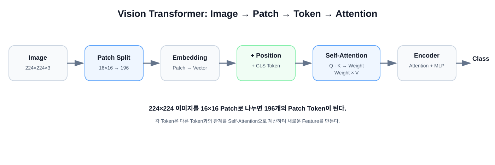

# 04. Vision Transformer — 이미지를 Token으로 바라보기

Vision Transformer(ViT)를 처음 접하는 사람을 위한 챕터입니다.

Transformer를 이미 알고 있다는 가정 없이 설명합니다. Patch, Token, Embedding처럼 처음 등장하는 용어는 이 챕터 안에서 바로 정의합니다.



## 학습 목표

이 챕터가 끝나면 다음을 설명할 수 있어야 합니다.

1. 왜 이미지를 Patch로 나누는가?
2. Patch와 Token은 어떤 관계인가?
3. Embedding은 무엇인가?
4. Q, K, V는 왜 필요한가?
5. Self-Attention이 실제로 무엇을 계산하는가?
6. Position Embedding과 CLS Token은 왜 필요한가?
7. CNN과 ViT는 무엇이 다른가?

---

# 1. 가장 먼저: Transformer는 원래 이미지 모델이 아니었다

Transformer는 처음에는 문장의 Token 사이 관계를 처리하는 구조로 널리 알려졌습니다.

예를 들어:

```text
"I love vision AI"

I      → Token
love   → Token
vision → Token
AI     → Token
```

그렇다면 이미지도 작은 조각으로 나눠 각각을 Token처럼 만들면 어떨까요?

이것이 ViT를 이해하는 가장 중요한 출발점입니다.

---

# 2. 이미지를 Patch로 나눈다

입력:

```text
224 × 224 × 3
```

Patch 크기:

```text
16 × 16
```

가로 방향 Patch 수:

```text
224 / 16 = 14
```

세로도 14개이므로:

```text
14 × 14 = 196 patches
```

즉 이미지 한 장을 196개의 작은 이미지 조각으로 바꿉니다.

---

# 3. Patch를 Token으로 만든다는 뜻

하나의 Patch:

```text
16 × 16 × 3
```

숫자 개수:

```text
16 × 16 × 3 = 768
```

Patch를 길게 펼치면 768개의 숫자가 됩니다.

```text
16×16×3 Patch
      ↓
   Flatten
      ↓
[768 numbers]
```

그다음 Linear Projection을 이용해 일정 길이의 Embedding Vector로 변환합니다.

```text
Patch
  ↓
Flatten / Projection
  ↓
Patch Embedding
  ↓
Token
```

**Token은 물리적인 이미지 조각 그 자체라기보다 Transformer가 처리할 수 있는 숫자 표현이라고 이해하면 됩니다.**

---

# 4. Embedding은 무엇인가?

Embedding은 대상을 숫자 Vector로 표현한 것입니다.

예를 들어 embedding dimension이 768이라면 하나의 Patch가 다음처럼 표현됩니다.

```text
Patch 1 → [0.13, -0.21, 0.04, ...]  768 values
Patch 2 → [0.05,  0.10, 0.37, ...]  768 values
...
Patch 196
```

이 Vector는 RGB 값을 그대로 의미하는 것이 아니라 학습에 유용한 표현 공간입니다.

---

# 5. 왜 Position Embedding이 필요한가?

CNN의 Kernel은 이미지 위를 움직이므로 공간 구조가 연산 방식에 자연스럽게 들어 있습니다.

Transformer는 Token 목록만 받으면 Token이 원래 이미지의 어디에 있었는지 자동으로 알지 못합니다.

그래서 위치 정보를 더합니다.

```text
Patch Embedding
      +
Position Embedding
      =
입력 Token
```

교육적으로는 다음처럼 생각할 수 있습니다.

```text
Token A + "좌측 상단"
Token B + "A의 오른쪽"
Token C + "그 아래"
```

실제 Position Embedding은 이런 문장이 아니라 숫자 Vector입니다.

---

# 6. CLS Token은 무엇인가?

Classification용 ViT에서는 특별한 Token 하나를 앞에 추가합니다.

```text
[CLS], Patch1, Patch2, ..., Patch196
```

총 Token 수:

```text
196 + 1 = 197
```

Transformer Encoder를 모두 통과한 뒤 CLS Token의 최종 Feature를 Classification Head에 사용합니다.

교육적으로는:

> CLS Token은 여러 Patch의 정보를 모아 최종 이미지 판단에 사용하는 대표 Token

이라고 이해하면 됩니다.

단, 모든 Vision Transformer가 반드시 CLS Token을 쓰는 것은 아닙니다.

---

# 7. Self-Attention이 필요한 이유

이미지 안에서 서로 멀리 떨어진 영역도 관련될 수 있습니다.

예를 들어 자동차 사진이라면:

- 앞바퀴와 뒷바퀴
- 창문과 차체
- 물체와 배경

사이 관계가 중요할 수 있습니다.

Self-Attention은 각 Token이 다른 Token을 얼마나 참고할지 계산합니다.

```text
현재 Token
   ↓
다른 모든 Token과 관련도 계산
   ↓
중요한 Token의 정보는 많이
덜 중요한 Token의 정보는 적게
   ↓
새로운 Token Feature
```

---

# 8. Q, K, V는 무엇인가?

Self-Attention의 가장 어려운 부분입니다.

각 Token에서 세 종류의 Vector를 만듭니다.

```text
Token
 ├─ Query (Q)
 ├─ Key   (K)
 └─ Value (V)
```

처음에는 이렇게 이해하면 됩니다.

### Query
"나는 어떤 정보를 찾고 있는가?"

### Key
"나는 어떤 특징을 가지고 있는가?"

### Value
"내가 실제로 전달할 정보는 무엇인가?"

이 설명은 이해를 돕기 위한 비유이고, 실제 Q/K/V는 학습 가능한 Linear Projection으로 만들어지는 Vector입니다.

---

# 9. Attention 계산을 숫자로 이해하기

Token A가 다른 Token을 얼마나 참고할지 계산한다고 해봅시다.

단순화한 결과가:

```text
A → B : 0.10
A → C : 0.60
A → D : 0.20
A → E : 0.10
```

이라면 Token A는 C의 Value를 가장 크게 반영합니다.

실제 Attention 공식:

```text
Attention(Q, K, V)
= softmax(QK^T / sqrt(d_k)) V
```

처음 공부할 때는 수식보다 다음 흐름을 먼저 이해하는 것이 좋습니다.

```text
Q와 모든 K 비교
      ↓
관련도 Score
      ↓
Scaling
      ↓
Softmax
      ↓
Attention Weight
      ↓
V를 가중합
      ↓
새로운 Feature
```

---

# 10. 왜 sqrt(d_k)로 나누는가?

Q와 K의 차원이 커지면 Dot Product 값의 크기도 커질 수 있습니다.

값이 너무 커지면 Softmax가 몇 개 위치에 과도하게 몰려 Gradient가 불안정해질 수 있습니다.

그래서 `sqrt(d_k)`로 나누어 Score의 Scale을 조절합니다.

이 때문에 이 방식을 **Scaled Dot-Product Attention**이라고 합니다.

---

# 11. Multi-Head Attention

Attention을 한 번만 하는 대신 여러 Head로 나눠 수행합니다.

```text
Tokens
 ├─ Head 1
 ├─ Head 2
 ├─ Head 3
 └─ ...
```

각 Head는 서로 다른 Q/K/V Projection을 가지므로 다른 관계를 학습할 수 있습니다.

교육적으로는:

- 한 Head는 형태 관계
- 다른 Head는 위치 관계
- 또 다른 Head는 Texture 관계

처럼 생각할 수 있습니다.

하지만 실제 Head가 사람이 붙인 의미대로 정확히 분리된다고 보장되는 것은 아닙니다.

---

# 12. Transformer Encoder Block

ViT의 핵심 반복 구조입니다.

```text
Input Tokens
     │
     ├───────────────┐
     ↓               │
 LayerNorm           │
     ↓               │
Multi-Head Attention │
     ↓               │
     + ←─────────────┘
     │
     ├───────────────┐
     ↓               │
 LayerNorm           │
     ↓               │
    MLP              │
     ↓               │
     + ←─────────────┘
     ↓
Output Tokens
```

여기에서 `+`는 Residual Connection입니다.

---

# 13. ViT 전체 흐름

```text
224×224×3 Image
      ↓
16×16 Patch Split
      ↓
196 Patches
      ↓
Patch Embedding
      ↓
196 Tokens
      ↓
CLS Token 추가
      ↓
197 Tokens
      ↓
Position Embedding
      ↓
Transformer Encoder
      ↓
Transformer Encoder
      ↓
...
      ↓
CLS Feature
      ↓
Classification Head
      ↓
Class Probability
```

이 흐름을 이해했다면 ViT의 큰 구조는 이미 이해한 것입니다.

---

# 14. CNN과 무엇이 다른가?

## CNN

```text
Image
 ↓
작은 Kernel
 ↓
Local Feature
 ↓
더 깊은 Conv
 ↓
점점 넓은 Feature
```

CNN은 **주변부터 시작해 점점 넓게 보는 구조**입니다.

## ViT

```text
Image
 ↓
Patch Tokens
 ↓
Self-Attention
 ↙  ↓  ↘
Token 사이 관계
 ↓
새로운 Feature
```

ViT는 **각 Patch 사이의 관계를 Attention으로 계산하는 구조**입니다.

---

# 15. Inductive Bias란?

모델이 학습 전에 이미 가지고 있는 구조적인 가정을 의미합니다.

CNN은 대표적으로:

- Locality: 가까운 Pixel끼리 관련성이 높을 가능성이 크다.
- Weight Sharing: 같은 Kernel을 이미지 여러 위치에서 사용한다.
- Translation Equivariance: 물체가 이동해도 비슷한 특징을 같은 Filter로 찾을 수 있다.

라는 이미지 친화적 구조를 가지고 있습니다.

원래 ViT는 이런 이미지 전용 가정이 CNN보다 상대적으로 약합니다.

그 대신 충분한 데이터와 학습 규모에서 매우 강력한 표현력을 보여줬습니다.

---

# 16. Patch 크기의 Trade-off

`224×224` 이미지 예시:

### Patch = 16
```text
14 × 14 = 196 tokens
```

### Patch = 8
```text
28 × 28 = 784 tokens
```

Patch가 작을수록 세밀한 정보를 유지할 수 있지만 Token 수가 크게 늘어납니다.

Self-Attention은 기본적으로 Token 간 모든 쌍의 관계를 계산하므로 Attention Matrix 크기는 대략 `N×N`입니다.

```text
196 tokens → 196² = 38,416
784 tokens → 784² = 614,656
```

Token 수는 4배지만 Matrix 원소 수는 16배입니다.

---

# 17. ViT를 한 문장으로

> **Vision Transformer는 이미지를 Patch Token의 집합으로 바꾸고 Self-Attention을 통해 각 Patch 사이의 관계를 학습하는 모델입니다.**

---

# 18. 처음 공부할 때 꼭 기억할 7개 단어

```text
Patch
 ↓
Token
 ↓
Embedding
 ↓
Position
 ↓
Q / K / V
 ↓
Self-Attention
 ↓
Transformer Encoder
```

이 7개의 연결 관계를 이해하면 ViT의 기본 구조를 이해한 것입니다.

---

# 19. 원 논문

**An Image is Worth 16×16 Words: Transformers for Image Recognition at Scale**

- Dosovitskiy et al.
- ICLR 2021
- https://openreview.net/forum?id=YicbFdNTTy
- https://arxiv.org/abs/2010.11929

논문을 처음부터 모두 읽기보다는 먼저 **Figure 1과 Method의 Patch Embedding / Transformer Encoder 부분**을 보는 것을 권장합니다.

---

# 20. 다음에 직접 해볼 실습

1. `224×224` 이미지를 `16×16` Patch로 직접 분할
2. 196개 Patch를 화면에 번호와 함께 표시
3. Patch 하나를 선택
4. 가상의 Attention Weight를 Heatmap으로 표시
5. CNN의 `3×3 Local Kernel`과 ViT의 `Global Attention`을 한 화면에서 비교

이 실습을 보면 ViT가 훨씬 빠르게 이해됩니다.
